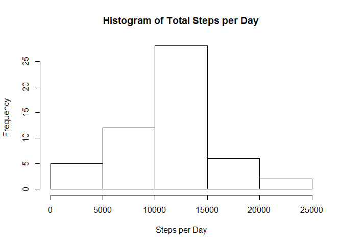
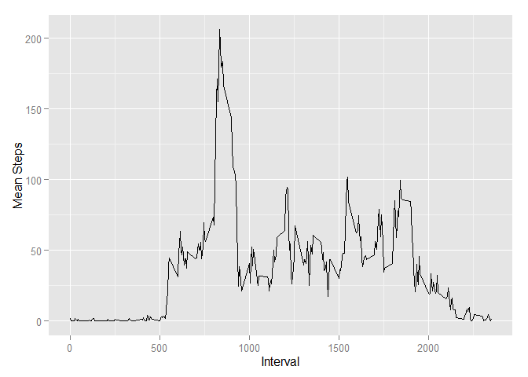
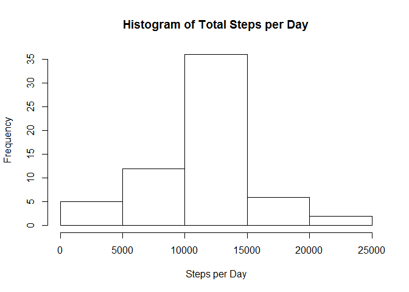
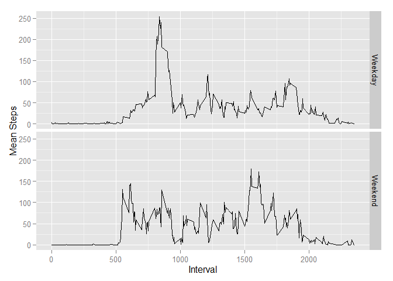

# Reproducible Research: Peer Assessment 1


***


```r
##library(dplyr)
```


##Loading and preprocessing the data 
***


```r
act <- read.csv("activity.csv")
options(scipen = 1, digits = 2)
```


##What is mean total number of steps taken per day?
***


```r
per_day <- tapply(act$steps, act$date, sum)

hist(per_day, main = "Histogram of Total Steps per Day", xlab = "Steps per Day")
```

 

```r
mn <- round(mean(per_day, na.rm = T), digits = 2)

md <- median(per_day, na.rm = T)
```


####The MEAN total number of steps per day is 10766.19  


####The MEDIAN total number of steps per day is 10765


##What is the average daily activity pattern?
***


```r
#use ggplot stat_summary to plot mean steps across all days
library(ggplot2)
require(ggplot2)
#act$ts <- formatC(act$interval, digits = 3, flag = 0)
#act$ts <- gsub("^(\\d{2})(\\d{2})$", "\\1:\\2", act$ts)
g <- ggplot(data = act, aes(act$interval, act$steps))
g <- g + stat_summary(fun.y = mean, geom = "line", na.rm = T)
g <- g + xlab("Interval") + ylab("Mean Steps")
g
```

 

```r
#get the max activity interval
act_ts <- reshape(act, idvar = "date", timevar = "interval", direction = "wide")
mns <- colMeans(act_ts[,-1], na.rm = T)
max_val <- max(mns)


#get the column name and format it as a time 
max_col <- names(which.max(mns))
max_col <- substr(max_col,7,10)
max_col <- formatC(as.numeric(max_col), digits = 3, flag = 0)
max_col <- gsub("^(\\d{2})(\\d{2})$", "\\1:\\2", max_col)
```


####The maximum activity occurs in the 08:35 interval when the average steps taken are 206.17.

##Imputing missing values
***

```r
# get the total na values
tot_na <- table(is.na(act$steps))[2]

# impute the median values and replace NA values
library(data.table)
act_dt <- data.table(act)
act_dt[,steps := ifelse(is.na(steps), as.integer(round(mean(steps, na.rm = T))), steps), by = interval]
```

```
##        steps       date interval
##     1:     2 2012-10-01        0
##     2:     0 2012-10-01        5
##     3:     0 2012-10-01       10
##     4:     0 2012-10-01       15
##     5:     0 2012-10-01       20
##    ---                          
## 17564:     5 2012-11-30     2335
## 17565:     3 2012-11-30     2340
## 17566:     1 2012-11-30     2345
## 17567:     0 2012-11-30     2350
## 17568:     1 2012-11-30     2355
```

```r
per_day <- tapply(act_dt$steps, act_dt$date, sum)

hist(per_day, main = "Histogram of Total Steps per Day", xlab = "Steps per Day")
```

 

```r
mn2 <- round(mean(per_day, na.rm = T), digits = 2)

md2 <- median(per_day, na.rm = T)
```

There are 2304 missing observations in the dataset. The MEAN total number of steps per day with imputed missing values is 10765.64. The difference between the non-imputed NA values and the imputed NA values is only 0.55 steps. The MEDIAN total number of steps per day is 10762 steps. The difference in median values is only 3 steps. The effect of imputing the values is negligible as expected because the percent of NA values was fairly low to begin with at 13.11%.


##Are there differences in activity patterns between weekdays and weekends?
***

```r
act_dt$wkdy <- "Weekday"
act_dt[,wkdy := ifelse(weekdays(as.Date(date)) %in% c("Saturday", "Sunday"), "Weekend", "Weekday")]
```

```
##        steps       date interval    wkdy
##     1:     2 2012-10-01        0 Weekday
##     2:     0 2012-10-01        5 Weekday
##     3:     0 2012-10-01       10 Weekday
##     4:     0 2012-10-01       15 Weekday
##     5:     0 2012-10-01       20 Weekday
##    ---                                  
## 17564:     5 2012-11-30     2335 Weekday
## 17565:     3 2012-11-30     2340 Weekday
## 17566:     1 2012-11-30     2345 Weekday
## 17567:     0 2012-11-30     2350 Weekday
## 17568:     1 2012-11-30     2355 Weekday
```

```r
ft <- factor(act_dt$wkdy)
g <- ggplot(data = act_dt, aes(act$interval, act$steps))
g <- g + stat_summary(fun.y = mean, geom = "line", na.rm = T)
g <- g + xlab("Interval") + ylab("Mean Steps")
g <- g + facet_grid(wkdy~.)
g
```

 

Yes, it appears that the spike in activity between 8-10 on weekdays is not there on weekends. Also the weekend activity is more constant and at ahigher level throughout the day.

